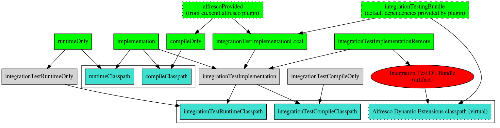
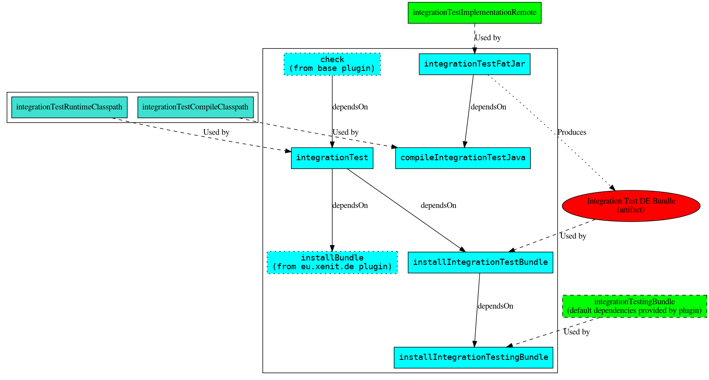

# Running integration tests with the Gradle plugin

The `eu.xenit.alfresco-remote-testrunner` sets up an environment where you can create and run integration tests using the Alfresco Remote Testrunner.

## Source code location

The plugin creates an `integrationTest` sourceset. You should place your integration tests there.

By default, the java source location is `src/integrationTest/java`, and resources can be placed in `src/integrationTest/resources`.

```
tests-example-gradle
├── build.gradle
├── docker-compose.yml
├── settings.gradle
└── src
    ├── integrationTest
    │   ├── java
    │   │   └── eu
    │   │       └── xenit
    │   │           └── example
    │   │               └── repo
    │   │                   └── tests
    │   │                       ├── AlfrescoIntegrationTest.java
    │   │                       └── SampleIntegrationTest.java
    │   └── resources
    └── main
        └── java
            └── eu
                └── xenit
                    └── example
                        └── repo
                            └── DummyService.java

```

## Configuration

To generate a correct DE bundle with your integration tests, we need the base package(s) that contain your integration test classes.

You can configure this in the `alfrescoIntegrationTest.integrationTestPackages` property as an array.

To be able to upload DE bundles to the Alfresco Repository, you must configure the `alfrescoDynamicExtensions.repository {}` block. This configuration is described in the [Dynamic Extensions Gradle Plugin documentation](https://github.com/xenit-eu/dynamic-extensions-for-alfresco/blob/master/documentation/Gradle_Plugin.md#configuration).

The Repository configuration is also used to generate the correct remote URL for the test runner.

### Example buildscript

```groovy
plugins {
    id "eu.xenit.alfresco-remote-testrunner" version "2.0.0"
    id "eu.xenit.de" version "2.0.1"
}

alfrescoIntegrationTest {
    integrationTestPackages = ["eu.xenit.example.test.base.package"]
}

// Configuration of Dynamic Extensions is used to configure the repository
alfrescoDynamicExtensions {
    repository {
        // Configure the URL to the Alfresco services endpoint
        endpoint {
            protocol = "http"
            host = "localhost"
            port = 8080
            serviceUrl = "/alfresco/service"
        }

        // Configure admin credentials to install DE bundles
        authentication {
            username = "admin"
            password = "admin"
        }
    }
}
```

## Classpaths

Contrary to "normal" java projects, where you have a compile and a runtime classpath, we will need to manage 3 classpaths here:

* compile classpath
* local runtime classpath: runtime classpath for the local JUnit stub.
* remote runtime classpath: runtime classpath of the integration test bundle installed in Dynamic Extensions.

Even though no user code is executed from the JUnit stub, the local runtime classpath needs to contain all classes that are imported in tests. The remote runtime classpath must contain all dependencies used by the integration tests, as all user code is executed there.

Dependencies for the `integrationTest` sourceset are configured as follows:

* `main` sourceset output is automatically included on the compile classpath and the local runtime classpath, not on the remote runtime classpath.
* Additional dependencies in the `integrationTestImplementationRemote` configuration are automatically embedded into the integration test DE bundle. They are on the compile, the local runtime classpath and the remote runtime classpath.
* Additional dependencies in the `integrationTestImplementationLocal` configuration are *only* on the compile and local runtime classpath.
* If the `alfrescoProvided` configuration (from [the `eu.xenit.alfresco` plugin](https://github.com/xenit-eu/alfresco-gradle-sdk)) exists, it will be wired in for the compile and local runtime classpath.
* Additionally, the `integrationTestingBundle` contains Alfresco Remote Testrunner DE bundle itself. By default, the version matching the version of this Gradle plugin is configured if no custom dependency is configured.

The following diagram is a summary of the descriptions above. You can use this legend to interpret the colors:

* Green background: You can declare dependencies against this configuration
* Turqoise background: The configuration is for consumption by tasks, not for you to declare dependencies
* Gray background: Internal configurations. You can declare dependencies here, but that is not recommended



## Tasks

To run integration tests, you will be mostly interested in the `check` (Gradle core, runs **all** tests) and `integrationTest` (runs only integration tests) tasks.

For completeness, all tasks that are created and modified by the plugin are described below. You usually don't need to run these yourself, but you may want to sometimes exclude some tasks with `--exclude-task` option.

This plugin installs DE bundles inside a running Alfresco instance. As such, it depends on the [`eu.xenit.de` plugin](https://github.com/xenit-eu/dynamic-extensions-for-alfresco/blob/master/documentation/Gradle_Plugin.md) to provide Alfresco Repository configuration and the `InstallBundle` task class.

* If the `installBundle` task (from the `eu.xenit.de` plugin) exists, the DE bundle for the main sourceset is re-installed. This helps with a faster feedback cycle, so Alfresco does not have to be restarted when the main sourceset is modified.
* The `installIntegrationTestingBundle` task installs the Alfresco Remote Testrunner DE bundle that is supplied by the `integrationTestingBundle` configuration.
* The `integrationTestFatJar` task creates a fat jar containing both the integration tests and their runtime dependencies as supplied by the `integrationTestImplementationRemote` configuration.
* The `installIntegrationTestBundle` task installs the fat jar created by the `integrationTestFatJar` task.

The `integrationTest` task is automatically configured with the Alfresco Repository URL and credentials, as configured in `alfrescoDynamicExtensions.repository`.

After all necessary bundles are installed, the `integrationTest` task will launch the integration tests on the remote Alfresco system.

As per Gradle conventions, the `check` task is configured to depend on the `integrationTest` task.



